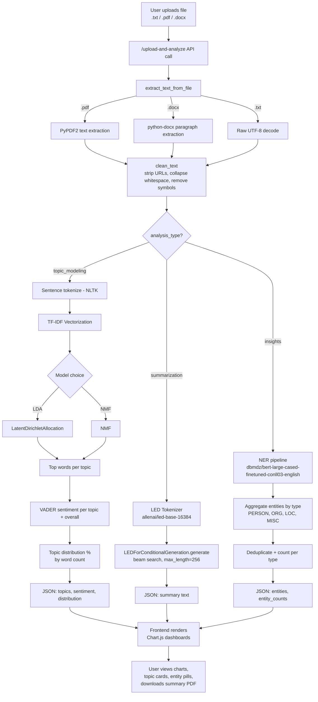

# 🧠 Narrative NeXus — AI-Powered Document Analysis

Narrative NeXus is a full-stack web app that turns raw documents (`.txt`, `.pdf`, `.docx`) into actionable insights using NLP. Upload a document and get **topic modeling**, **abstractive summarization**, and **named-entity insights** — all visualized in an interactive dashboard.

---

## 📸 Screenshots

> Replace these placeholders with real screenshots once you push to GitHub.
> Save your images inside a `/screenshots` folder in the repo root and update the paths below.

| Landing Page | Analysis Dashboard |
|---|---|
|  |  |

<sub>Tip: Take a screenshot of `index.html` running in your browser (landing page + one analysis result, e.g. the Topic Analysis dashboard with charts) and drop them into `/screenshots/` with the filenames above.</sub>

---

## 🚀 How It Works

1. **Frontend (`index.html`)** — A single-page app built with Tailwind CSS + Chart.js. Users land on a hero page, enter the app, upload a document via drag-and-drop, and choose an analysis type from the sidebar (Topic Analysis, Summarization, Insights).
2. **Backend (Flask API, `app.py`)** — Receives the uploaded file, extracts raw text, cleans it, and routes it to one of three NLP pipelines based on the requested `analysis_type`.
3. **Results** — The backend returns JSON, which the frontend renders as interactive charts (Chart.js) and cards — topic word clouds, sentiment scores, entity pills, and a downloadable PDF summary.
4. **Auth** — Basic username/password sign-up and sign-in against a local database (`database.py`), using `werkzeug` password hashing (no real session/JWT yet — for demo purposes).

---

## 🔀 NLP Pipeline Flowchart



### Pipeline summary

| Feature | Technique | Model / Library |
|---|---|---|
| Text extraction | Format-specific parsing | `PyPDF2`, `python-docx` |
| Text cleaning | Regex normalization | Python `re` |
| Topic Modeling | Unsupervised topic discovery | `scikit-learn` — LDA / NMF over TF-IDF |
| Sentiment | Lexicon-based scoring | `VADER` (per topic + overall document) |
| Summarization | Abstractive, long-document | `LED` (Longformer Encoder-Decoder) via 🤗 `transformers` |
| Entity Insights | Named Entity Recognition | BERT NER (`dbmdz/bert-large-cased-finetuned-conll03-english`) |

---

## 🛠️ Tech Stack

**Frontend:** HTML, Tailwind CSS, Chart.js, jsPDF, Font Awesome
**Backend:** Flask, Flask-CORS, PyTorch, Hugging Face Transformers, scikit-learn, NLTK, VADER Sentiment, PyPDF2, python-docx, Werkzeug

---

## ⚙️ Setup & Installation

```bash
# Clone the repo
git clone https://github.com/<your-username>/narrative-nexus.git
cd narrative-nexus

# Create a virtual environment
python -m venv venv
source venv/bin/activate   # On Windows: venv\Scripts\activate

# Install dependencies
pip install flask flask-cors torch transformers nltk scikit-learn vaderSentiment PyPDF2 python-docx werkzeug

# Run the backend
python app.py
```

Then open `index.html` in your browser (the frontend calls the API at `http://127.0.0.1:5001`).

---

## 📂 Project Structure

```
narrative-nexus/
├── index.html          # Frontend SPA (upload, dashboard, auth UI)
├── app.py              # Flask backend + NLP pipelines
├── database.py          # SQLite user auth storage
├── screenshots/         # Add your app screenshots here
└── README.md
```

---

## 📝 Notes

- Summarization and Insights features require model downloads on first run (LED + BERT NER) — this may take a few minutes and needs a decent amount of disk/RAM.
- Authentication here is for demo purposes only (no session tokens/JWT) — do not use as-is in production.
