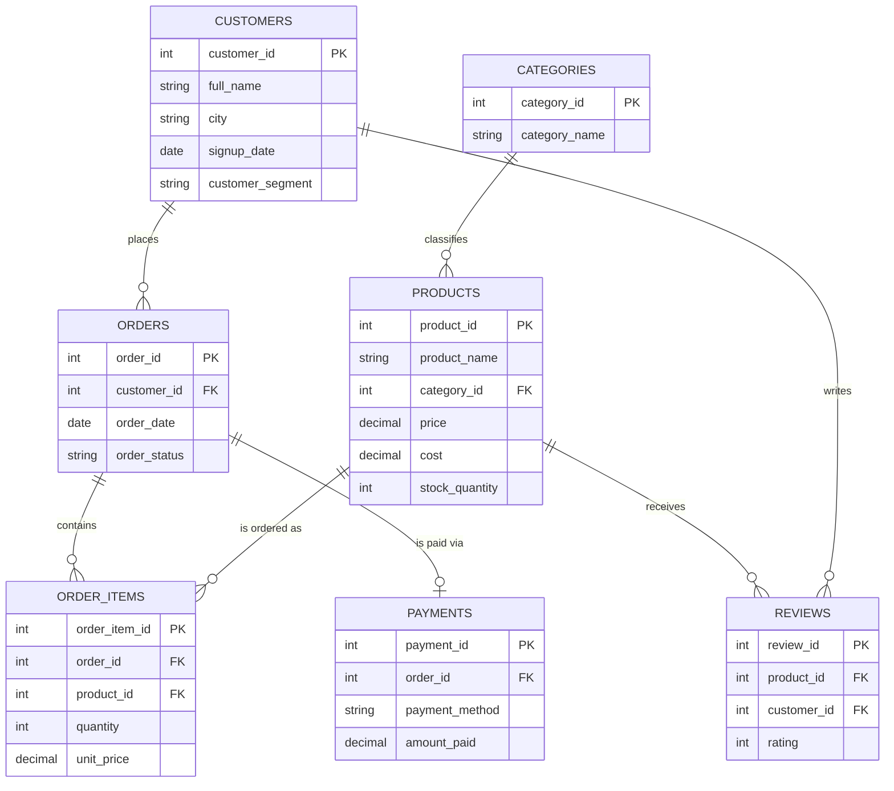

# 🛒 E-Commerce Sales & Customer Analysis — SQL Project

A real-world business problem solved with SQL: an online retailer wants to understand
**where its revenue comes from, which customers are its most valuable, which ones are
about to churn, and which products are actually profitable** (not just popular).
This project models the store's data and answers those questions with SQL.

## The Business Problem

> "We have months of sales data sitting in our database, but no one can tell me:
> which customers we're at risk of losing, whether our best-selling products are
> actually our most profitable ones, or how our revenue is trending month to month."

This is a common ask for data/business analysts — turning raw transactional data into
decisions the business can act on.

## Tech Stack
- **Database**: MySQL (works directly on [DB Fiddle](https://www.db-fiddle.com/) — select MySQL 8.0)
- **SQL concepts used**: multi-table JOINs, CTEs, window functions (`RANK`, `LAG`),
  `CASE`-based segmentation, subqueries, date/time analysis, conditional aggregation

## Entity-Relationship Diagram



## Project Structure
```
ecommerce-sales-analysis/
│
├── diagrams/
│   └── database-design.png      # Visual schema diagram (tables, keys, relationships)
│
├── sql/
│   ├── 01_schema.sql            # Table definitions, keys, indexes
│   ├── 02_sample_data.sql       # ~25 orders across 10 customers, 15 products
│   └── 03_analysis_queries.sql  # 12 business-driven analytical queries
│
└── README.md
```

## Database Design Highlights


- **7 normalized tables**: `customers`, `categories`, `products`, `orders`,
  `order_items`, `payments`, `reviews`
- Separates **order-level** data from **line-item-level** data (`orders` vs
  `order_items`) — the standard real-world pattern for handling multi-product carts
- Stores **cost alongside price** on products, enabling margin/profitability analysis
  (not just revenue — a common gap in beginner projects)
- Tracks **order_status** (Completed / Cancelled / Returned) so cancelled orders don't
  inflate revenue numbers
- **Indexes** on foreign keys used in frequent joins (`customer_id`, `product_id`, `order_id`)

## Key Queries & the Business Question Each One Answers

| # | Business Question | SQL Concepts Used |
|---|--------------------|--------------------|
| 1 | How is our revenue trending month to month? | `DATE_FORMAT`, `GROUP BY` |
| 2 | Which products sell the most? | JOIN, aggregation, `ORDER BY` + `LIMIT` |
| 2b | Which products are actually most **profitable**? | Margin calculation, `AVG()` |
| 3 | Who are our highest lifetime-value customers? | Multi-table JOIN, aggregation |
| 4 | How do we segment customers by RFM (Recency/Frequency/Monetary)? | CTE, `CASE`, `DATEDIFF` |
| 5 | Which customers are at risk of churning? | `HAVING`, date filtering |
| 6 | What % of orders get cancelled or returned? | Subquery, conditional aggregation |
| 7 | Which product category drives the most revenue? | Multi-table JOIN |
| 8 | Who are the top spenders within each customer segment? | Window function `RANK() OVER(PARTITION BY...)` |
| 9 | Which payment methods do customers prefer? | `GROUP BY`, aggregation |
| 10 | Are any popular products getting bad reviews (a hidden risk)? | JOIN, `HAVING AVG(...)` |
| 11 | What's our month-over-month growth rate? | Window function `LAG()`, CTE |
| 12 | How much revenue comes from new vs. repeat customers? | CTE, `CASE` |

Full queries live in [`sql/03_analysis_queries.sql`](sql/03_analysis_queries.sql).

## Sample Insights (from the included sample data)
- **Query 4 (RFM segmentation)** flags customers who haven't ordered in 90+ days as
  "At Risk" — actionable for a targeted win-back email campaign.
- **Query 2 vs 2b** shows that the best-*selling* product isn't always the most
  *profitable* one once cost is factored in — a real gap many dashboards miss.
- **Query 6** quantifies how much revenue is lost to cancellations/returns, which is
  often the first number a business asks for.

## How to Run This Project
1. Go to [DB Fiddle](https://www.db-fiddle.com/) and select **MySQL 8.0**.
2. Paste `01_schema.sql` + `02_sample_data.sql` into the left panel → **Build Schema**.
3. Paste any query from `03_analysis_queries.sql` into the right panel → **Run**.
4. (Optional) Install MySQL Workbench locally to run the same files and take
   screenshots of the output for your portfolio/README.

## Possible Extensions
- Build a Power BI / Tableau dashboard on top of the RFM and revenue-trend queries
- Add a `coupons`/`discounts` table and measure discount impact on margin
- Add stored procedures to auto-flag churn-risk customers weekly
- Cohort retention analysis (% of each signup month still ordering N months later)

## Author
Built as a portfolio project to demonstrate SQL-driven business problem solving —
translating a vague business ask into a concrete, queryable data model.
